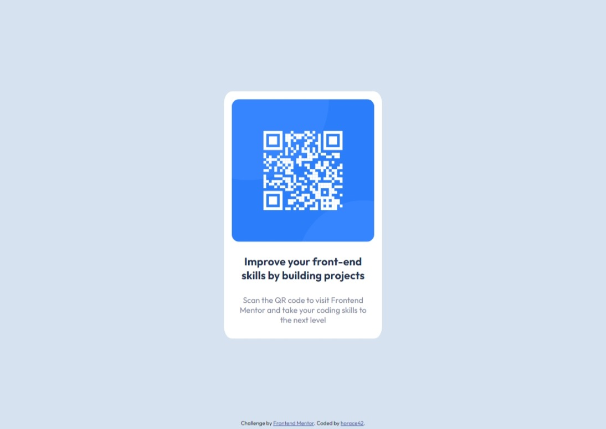

# Frontend Mentor - QR code component solution

This is a solution to the [QR code component challenge on Frontend Mentor](https://www.frontendmentor.io/challenges/qr-code-component-iux_sIO_H). Frontend Mentor challenges help you improve your coding skills by building realistic projects.

## Table of contents

- [Overview](#overview)
  - [Screenshot](#screenshot)
  - [Links](#links)
- [My process](#my-process)
  - [Built with](#built-with)
  - [What I learned](#what-i-learned)
  - [Continued development](#continued-development)
  - [Useful resources](#useful-resources)
- [Author](#author)
- [Acknowledgments](#acknowledgments)

## Overview

### Screenshot

### Links

- Solution URL: [Add solution URL here](https://your-solution-url.com)
- Live Site URL: [Add live site URL here](https://your-live-site-url.com)

## My process

### Built with

- Pulsar Editor
- Chrome Developer tools

### What I learned

This is my first challenge after completing the HTML & CSS section of the "100 Days of Code - The Complete Python Pro Bootcamp" by Dr. Angela Yu.
Almost everything is brand new to me, as part of the challenge I learned how to position an element in the center of the screen.

### Continued development

I don't intend to become a web designer or front-end developer, but I need to have a solid knowledge in this area.

### Useful resources

- [Example resource 1](https://stackoverflow.com/questions/9622354/make-a-div-center-of-viewport-horizontally-and-vertically) - This helped me understand position: absolute and margins.

## Author

- Website - [horace42](https://github.com/horace42)

## Acknowledgments

Google, MDN, W3Schools, StackOverflow 😉
